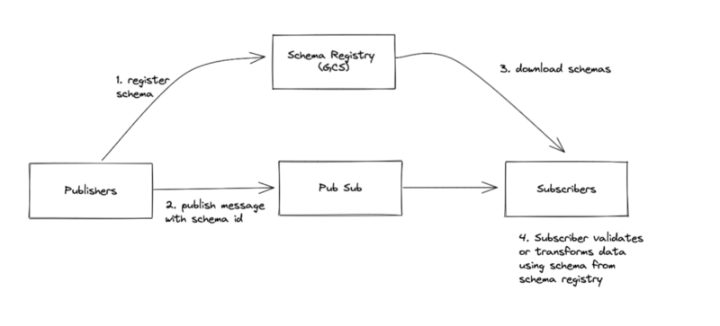

# schema-registry
This is a basic schema registry implementation which includes example schemas
and a cloudbuild script to deploy changes into GCS.

It is mainly just a POC that could be extended for a more robust implementation.

